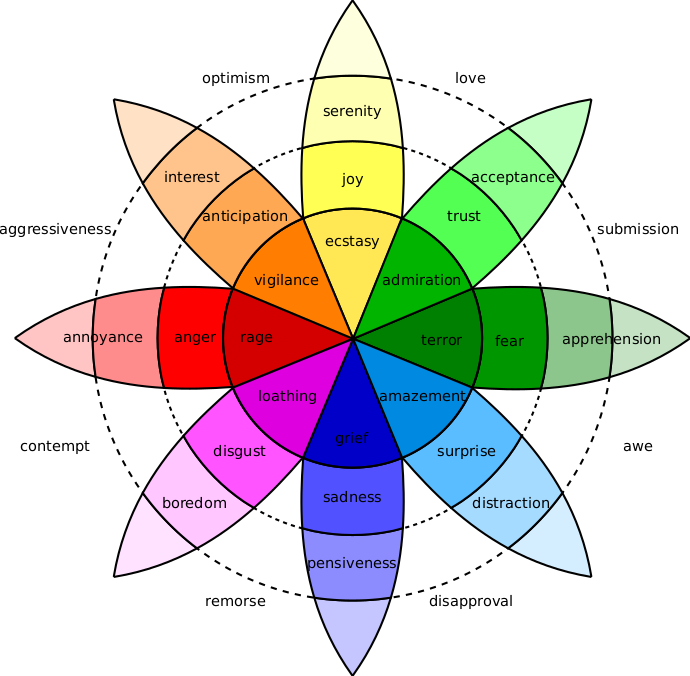
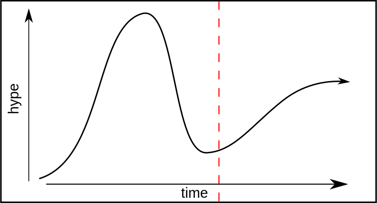
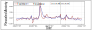
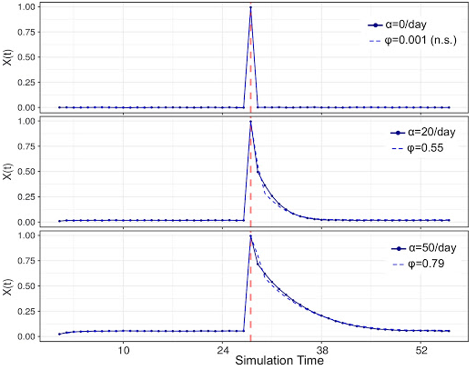
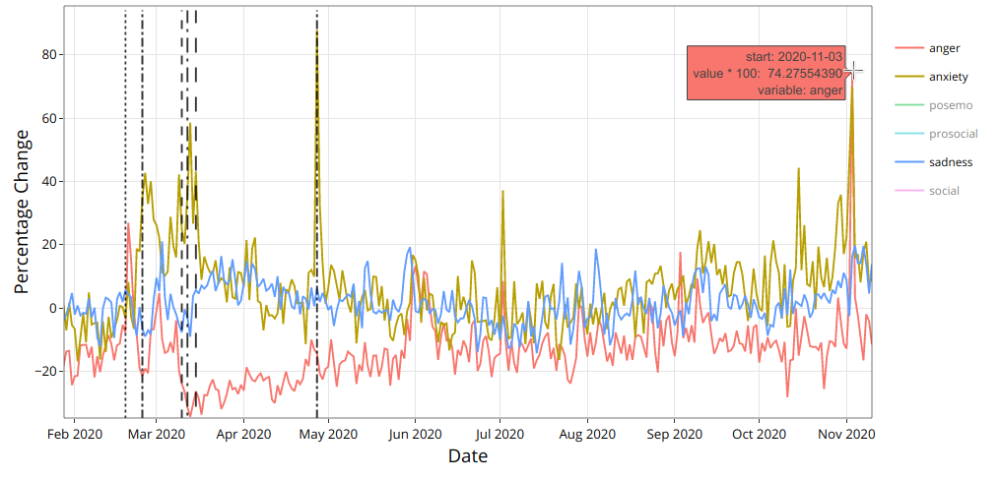
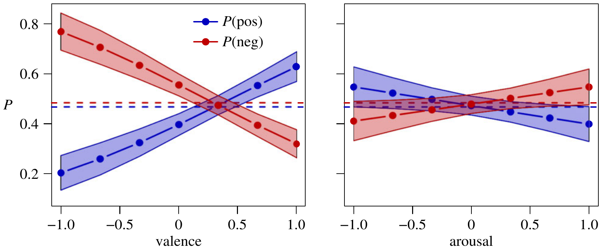

```{r xaringan-themer, include=FALSE, warning=FALSE}
#This block contains the theme configuration for the CSS lab slides style
library(xaringanthemer)
library(showtext)
style_mono_accent(
  base_color = "#5c5c5c",
  text_font_size = "1.5rem",
  header_font_google = google_font("Arial"),
  text_font_google   = google_font("Arial", "300", "300i"),
  code_font_google   = google_font("Fira Mono")
)
```

```{r setup, include=FALSE}
options(htmltools.dir.version = FALSE)
```


layout: true
<div class="my-footer"><span>David Garcia - Computational Social Science Lab - TU Graz + CSH Vienna</span></div> 

---

background-image: url(figures/AboutUS.svg)
background-size: 98%

---

# Overview

</br>
##1. Computational Affective Science

##2. Social Media Macroscopes of Emotions

##3. Collective Emotions and Social Resilence

---

# What are emotions?

> Emotions as **core affect**: Short-lived psychological states that consume the individual's energy and strongly influence cognition and behavior, for example expression.

Emotional or affective behavior of an individual takes place at various timescales:


- Reflex reactions: fast physiological responses  
- Core affect: relax quickly and are triggered by a stimulus
- Mood: slow-changing and constant emotional state 
- Personality traits are lifelong behavior patterns, some about emotions

---

# Computational Affective Science

> **Affective Science** is the (interdisciplinary) scientific study of emotions. 

> **Computational Affective Science** applies methods from Computer Science and Data Science to Affective Science. 

Some examples are affective computing, cyberpsychology of affect, emotion recognition, and sentiment analysis.

.center[]

---

# Measuring emotions

Emotions can be measured through various signals and observable behaviors:


In the following, we are going to cover four models of how to capture emotions in quantitative research. Some approaches are better for some modes or signals (e.g. text, facial expression) than others.

---

# Ekman's basic emotions model

.center[]
Developed by **Paul Ekman** to classify facial expression of emotions. 
---

# Plutchik's wheel of emotions
.center[]

---

# The circumplex model of affect

.center[]

---

# Dimensions in the circumplex model


> **Valence:** the degree of pleasure experienced in an emotion  
  
- Explains the most variance from positive/pleasant to negative/unpleasant
- It can be measured physiologically with smiling and frowning muscle activity
- It is the most common dimension of emotions included in text analysis  

> **Arousal:** the level of activity associated with an emotion  

- Explains less variance than valence but it is informative to differentiate emotions  
- It can be measured with skin conductance and heart rate sensors  
- Not so common in text analysis but can be estimated from voice tone  

Extensions include other dimensions: dominance and surprise
---

# Positive And Negative Affect Schedule

.center[]

Two simultaneous dimensions of Positive Affect and Negative Affect (PANAS).  
Commonly known as the *mood* model.
---

<center>
```{r, echo=FALSE, out.width=1200}
knitr::include_graphics("figures/CSSinfo.png")
```

---

## *Computational* in Computational Social Science
It can have three meanings:

- **Digital**<br> 
Based on large datasets of human behavior, for example produced by the Web and social media

- **Computerized**<br>
The quantitative analysis of data in an automated, tractable, repeatable, and extensible fashion

- **Generative**<br>
Application of data and results to design of agent-based models that explain complex social phenomena and motivate interventions

---

## The Hype Cycle of Computational Social Science
<center>
```{r, echo=FALSE, out.width=900}

```

---
## The Hype Cycle of Computational Social Science
<center>
```{r, echo=FALSE, out.width=900}
knitr::include_graphics("figures/Hype3.svg")
```

---

## Strengths and weaknesses of digital trace data

**Strengths:**
- Complementary approach to traditional survey and experimental methods
- Unprecedented scales and granularities
- Ease of data access, replicability of results
- Potentially high external validity, behavior in vivo

**Weaknesses:**
- Limits to internal validity: Lack of counterfactuals hinders causal analysis
- Self-selection bias: Who talks? Normalization issues: Who is silent?
- Data gatekeepers, Twitter as a model organism
- Intractability of black-box predictions and data piñatas

<div style="font-size:15pt">
Bit By Bit: Social Research in the Digital Age. M. Salganik (2017)
</div>

<div style="font-size:15pt">
Meaningful measures of human society in the twenty-first century. D. Lazer et al. (2021)
</div>


---

# Avoid making a data piñata

```{r, echo=FALSE, out.width=1050}
knitr::include_graphics("figures/pinata.png")
```

---

background-image: url(figures/VennV2-1.svg)
background-size: 97%
---
background-image: url(figures/VennV2.svg)
background-size: 97%
---

layout: true
<div class="my-footer"><span>
<a href=https://arxiv.org/abs/2107.13236> Social media emotion macroscopes reflect emotional experiences in society at large. David Garcia, Max Pellert, Jana Lasser, Hannah Metzler. https://arxiv.org/abs/2107.13236 (2021)</a></span></div>

---
# Social Media Macroscopes of Emotions


</br>
##1. Computational Affective Science

##2. *Social Media Macroscopes of Emotions*

##3. Collective Emotions and Social Resilence

---

```{r, echo=FALSE, out.width=950, fig.align='center'}

```

---

# Social Media Macroscopes of Emotions

.pull-left[
```{r, echo=FALSE, out.width=1100}
knitr::include_graphics("figures/Macy.jpg")
```
<font size="5">
<a href="https://science.sciencemag.org/content/333/6051/1878/"> Diurnal and seasonal mood vary with work, sleep, and daylength across diverse cultures. Golder & Macy, Science (2011) </a>
</font>
]

.pull-right[
```{r, echo=FALSE, out.width=1100}
knitr::include_graphics("figures/hedonometer.png")
```

<font size="5">
<a href="https://journals.plos.org/plosone/article?id=10.1371/journal.pone.0026752"> Temporal patterns of happiness and information in a global social network: Hedonometrics and Twitter. Dodds et al. PLoS One (2011) </a>
</font>
]

---

## Methods: Linguistic Signals in Text

**Linguistic Inquiry and Word Count, LIWC (pronounced “Luke”)**  
- Simple word matching method  
- Generated and validated by psychologists (Pennebaker et al., 2001-2015)
- Multiple classes, calibrated for netspeak and neologisms


.pull-left[
```{r, echo=FALSE, out.width=1000}
knitr::include_graphics("figures/LIWC.png")
```
]
.pull-right[
**Examples of LIWC classes:**  
Positive Affect, Negative Affect  
Anxiety, Sadness, Anger  
Social processes  
Prosocial terms (Frimer, et. al, 2014)  
French values (libert\*, egalit\*, fraternit\*)
]


---

## Methods: Supervised emotion detection in tweets

```{r, echo=FALSE, out.width=1100}

```

https://huggingface.co/maxpe/twitter-roberta-base_semeval18_emodetection

https://huggingface.co/oliverguhr/german-sentiment-bert
---

## Limits of Social Media Data to Study Emotion

```{r, echo=FALSE, out.width=1100}
knitr::include_graphics("figures/Jaidka.png")
```

[Estimating geographic subjective well-being from Twitter: A comparison of dictionary and data-driven language methods. Jaidka et al. PNAS (2020)](https://www.pnas.org/content/117/19/10165.short)

**More later today in journal club!**

---
# Validating a UK emotion macroscope

```{r, echo=FALSE, out.width=975, fig.align='center'}

```

---

# Data to test the macroscope

```{r, echo=FALSE, out.width=1100, fig.align='center'}
knitr::include_graphics("figures/Data.svg")
```

- Text analysis: dictionary-based (LIWC) and supervised (RoBERTa)
- Gender-rescaled time series of emotional expression
- Pre-registered hypotheses with prediction period from Nov 2020
---

# Sadness in Twitter and YouGov

```{r, echo=FALSE, out.width=1200, fig.align='center'}
knitr::include_graphics("figures/Sadness.svg")
```

- Similar results with dictionary-based and supervised methods (r~0.65)
---
# Anxiety in Twitter and YouGov

```{r, echo=FALSE, out.width=1200, fig.align='center'}

```

- Improvement thanks to gender information in tweets

---
# Joy in Twitter and YouGov

```{r, echo=FALSE, out.width=1200, fig.align='center'}
knitr::include_graphics("figures/Joy.svg")
```

- Good correlation with supervised method but no correlation with dictionary-based method


---
# Overview of results

```{r, echo=FALSE, out.width=1200, fig.align='center'}
knitr::include_graphics("figures/Corrs.png")
```

- Consistent results for both methods in sadness
- Similar for anxiety except for the classifier in the prediction period
- LIWC positive largely fails: lexicon is too general
- Joy supervised classifier has similar correlation as negative classifiers
---

# Exploring 12 emotional states
.pull-left[

- Time series of number sentences like "I am [emotion]" on Twitter

- Weak correlations happen for infrequent emotions in text

- Comparison: US weekly pre-election polls correlate with 0.66

- Arxiv preprint at https://arxiv.org/abs/2107.13236

]

.pull-right[
```{r, echo=FALSE, out.width=700}
knitr::include_graphics("figures/Figure2.svg")
```
]

---

layout: true
<div class="my-footer"><span>
Validating daily social media macroscopes of emotions. Max Pellert, Hannah Metzler, Michael Matzenberger, David Garcia. Scientific Reports (2022)</span></div>

---

## Study 2: Austrian macroscope in Der Standard

.pull-left[

- 20-day emotion survey in derstandard.at (N=268,128)
- Daily frequency, 3-day windows

- Text from Der Standard forum (N=452,013)

- Austrian tweets (N=515,187) filtered as UK macroscope

- Compared dictionary-based (LIWC) and supervised model (GS)

]
.pull-right[
```{r, echo=FALSE, out.width=450}
knitr::include_graphics("figures/Umfrage.png")
```
]

---

## Survey emotions and Der Standard sentiment

```{r, echo=FALSE, out.width=1000, fig.align='center'}

```

---

## Survey emotions and Twitter sentiment

```{r, echo=FALSE, out.width=1000, fig.align='center'}
knitr::include_graphics("figures/DS2.svg")
```

---


## Testing various configurations

```{r, echo=FALSE, out.width=1000, fig.align='center'}

```


---

# Correlations with new COVID-19 cases

.pull-left[
```{r, echo=FALSE, out.width=600}
knitr::include_graphics("figures/DS31.svg")
```
]
.pull-right[
```{r, echo=FALSE, out.width=600}
knitr::include_graphics("figures/DS32.svg")
```
]

- Do correlations attenuate due to additional social media measurement error?
- Survey emotion correlation with new cases as strong as Twitter sentiment
- Errors sources might be different: Need for conceptual validations

---


## Online Media for Social Sensing of Emotions?

```{r, echo=FALSE, out.width=850, fig.align='center'}
knitr::include_graphics("figures/socialsensing.svg")
```

---

## Social media macroscopes: Take-home message

```{r, echo=FALSE, out.width=950, fig.align='center'}

```

**Despite important concerns about Computational Social Science methods in terms of representativity and online behavior, social media macroscopes of emotion can substantially agree with established social science methods**

---


## Collective Emotions and Social Resilence


</br>
##1. Computational Affective Science

##2. Social Media Macroscopes of Emotions

##3. *Collective Emotions and Social Resilence*

---


layout: true
<div class="my-footer"><span>
<a href=https://doi.org/10.1177%2F0956797619831964> Collective Emotions and Social Resilience in the Digital Traces After a Terrorist Attack. David Garcia Bernard Rimé. Psychological Science (2019)</a></span></div> 

---

## The Social Function of Collective Emotions

<center>
```{r, echo=FALSE, out.width=900}
knitr::include_graphics("figures/ColectiveEmotions.png")
```
</center>

- **Theory of collective effervescence** (Durkheim, 1912):
Shared emotions generate social identity, reinforce shared beliefs, and lead to higher solidarity

- **Collective emotions** (von Scheve and Salmela, 2014):   
Emotional states shared by a large amount of people at the same time


---

background-size: 40%
background-image: url(figures/Trauma.png)
background-position: 90% 60%


## Emotional Responses to Collective Traumas

**How do societies respond to traumatic events?**  
**Is there a social function of collective emotions?**
.pull-left[
- Emotional synchronization: Experience of simultaneous negative emotions

- Collective emotion lasts longer than individual emotional reactions

- Individuals that participate in the collective emotions show higher levels of long-term solidarity ]

---


## Agent-Based Modelling of Collective Emotions

.pull-left[
```{r, echo=FALSE, out.width=1000}
knitr::include_graphics("figures/Framework.png")
```

ABM calibrated with experiment data
- φ: post-shock AR(1) term
- φ~0: subcritical response
- φ>0: critical, collective behavior
]

.pull-right[
```{r, echo=FALSE, out.width=450}


```
<center>
Mean valence in simulations
</center>
]

<div style="font-size:14pt">
[The Dynamics of Emotions in Online Interaction. Garcia et al. Royal Society Open Science 3 (2016)](https://royalsocietypublishing.org/doi/full/10.1098/rsos.160059)

---

## Twitter Digital Traces after a Terrorist Attack

Focus on Paris Attacks of of Nov 13, 2015  
Removed bots, news media, and organizations. Final sample of 62,114 users  
Retrieved historical timeline of users. Total of more than 27 Million tweets (no RT)
<center>
```{r, echo=FALSE, out.width=900}
knitr::include_graphics("figures/ParisCase.png")
```

---


## Evidence of Collective Emotions
<center>
```{r, echo=FALSE, out.width=750}
knitr::include_graphics("figures/TS.png")
```
</center>

---

### Collective Dynamics of Social Resilience Indicators
<center>
```{r, echo=FALSE, out.width=720}
knitr::include_graphics("figures/TS2.png")
```
</center>


---

## Emotional Synchronization Effect

.pull-left[
<center>
```{r, echo=FALSE, out.width=470}
knitr::include_graphics("figures/TS3.png")
```
</center>
]

.pull-right[
Division of users into two groups based on their emotional expression two weeks after the attacks

Frequency of social process terms:
- Very similar before the attacks
- Strong difference after the attacks
- Difference lasts for months

Similar effect for prosocial terms and shared values terms
]

---

# Conclusions of Paris attacks study

- Terrorist attacks trigger collective emotions that we can observe online

- Terms related to social resilience increase after collective emotions

- Individuals expressing stronger emotions used on average more terms related to social processes, prosocial behavior, and shared values

- Collective emotions are not just venting, they can keep us together

- Negative effects: inter-group conflict, intolerance, short-term orientation...

- Online interactive visualization at: http://dgarcia.eu/ParisAttacks.html

[**Collective Emotions and Social Resilience in the Digital Traces After a Terrorist Attack. David Garcia Bernard Rimé. Psychological Science (2019)**](https://journals.sagepub.com/doi/full/10.1177/0956797619831964)


---
# Summary

- [**Social Media Data in Affective Science.** Max Pellert, Simon Schweighofer and David Garcia. Handbook of Computational Social Science (2022)](https://www.routledge.com/Handbook-of-Computational-Social-Science-Volume-1-Theory-Case-Studies/Engel-Quan-Haase-Liu-Lyberg/p/book/9780367456528)
- [**Social media emotion macroscopes reflect emotional experiences in society at large.** David Garcia, Max Pellert, Jana Lasser, Hannah Metzler. Arxiv preprint (2021)](https://arxiv.org/abs/2107.13236)
- [**Validating daily social media macroscopes of emotions. Max Pellert, Hannah Metzler, Michael Matzenberger, David Garcia.** Scientific Reports (2022)](https://www.nature.com/articles/s41598-022-14579-y)
- [**Collective Emotions and Social Resilience in the Digital Traces After a Terrorist Attack.** David Garcia, Bernard Rimé. Psychological Science (2019)](https://journals.sagepub.com/doi/full/10.1177/0956797619831964)
  
### About to open a Postdoc position in Konstanz!

**More at: [http://dgarcia.eu](https://dgarcia.eu) and Twitter: [@dgarcia_eu](https://twitter.com/dgarcia_eu)**


---

# Slides appendix


---


---


## Appendix 1: The Vienna terrorist attack of Nov 2nd


---


## Austrian Emotions on Twitter

```{r, echo=FALSE, out.width=900}

```

<div style="font-size:15pt"> 
Paper: [Dashboard of Sentiment in Austrian Social Media During COVID-19. Frontiers in Big Data. Pellert et al. (2020)](https://www.frontiersin.org/articles/10.3389/fdata.2020.00032/full)  
Dashboard: https://mpellert.at/covid19_monitor_austria
---

## Austrian Emotions in Der Standard Tickers

```{r, echo=FALSE, out.width=900}

```
<div style="font-size:15pt"> 
Paper: [Dashboard of Sentiment in Austrian Social Media During COVID-19. Frontiers in Big Data. Pellert et al. (2020)](https://www.frontiersin.org/articles/10.3389/fdata.2020.00032/full)  
Dashboard: https://mpellert.at/covid19_monitor_austria

---

background-size: 50%
background-image: url(figures/OpenDoor.gif)
background-position: 90% 60%


## Shelter offerings on Twitter

.pull-left[

- Number of tweets with hashtags similar to [#Schwedenplatztür](https://twitter.com/hashtag/schwedenplatzt%C3%BCr)
- More in Twitte thread:
https://twitter.com/dgarcia_eu/status/1324097342551842817
]

---

## Appendix 2: Emotions as a CUSP catastrophe

```{r, echo=FALSE, out.width=800, fig.align='center'}

```

A systems approach to appraisal mechanisms in emotion. David Sander, Didier Grandjean, Klaus R. Scherer. Neural Networks (2005)

---

# Emotions and the free energy principle

```{r, echo=FALSE, out.width=880, fig.align='center'}

```

Emotional Valence and the Free-Energy Principle. Mateus Joffily, Giorgio Coricelli. PLOS Computational Biology (2013)
---

## The Cyberemotions modelling framework

```{r, echo=FALSE, out.width=500, fig.align='center'}
knitr::include_graphics("figures/Cyberemotions.png")
```

- Horizontal: agent design
  - $v$, $a$: internal valence and arousal emotional state of the agent
  - $s$: visible emotional expression as measured (e.g. pos/neg/neu)
- Vertical: interaction between agents
  - $h$ is a communication field averaging recent expression of agents
  - Agent's emotions change with time and the value of $h$
---

# Valence and arousal dynamics

```{r, echo=FALSE, out.width=900, fig.align='center'}
knitr::include_graphics("figures/Dynamics1.png")
```

- $b,d$: baselines of valence and arousal
- $\gamma_v$, $\gamma_a$: relaxation tendency of valence and arousal towards baselines
- $\xi_v$, $\xi_a$: stochastic components of valence and arousal dynamics

[The dynamics of emotions in online interaction. David Garcia, Arvid Kappas, Dennis Küster and Frank Schweitzer. Royal Society Open Science (2016)](https://royalsocietypublishing.org/doi/10.1098/rsos.160059)

---
# Examples of field influence functions

```{r, echo=FALSE, out.width=1000, fig.align='center'}
knitr::include_graphics("figures/Dynamics2.png")
```

- Field influence functions as products of a polynomial of valence and arousal

- Approximation to some unknown function to fit empirically

- Valence depends on $h$ (pos/neg) and arousal on $|h|$ (absolute value)

---

# Activation function

$$\large s_i(t) = f_s(v_i(t)) \Theta [a_i(t) - \tau_i]$$
- $s_i(t)$ is the visible emotional expression of agent $i$ aggregated in field $h$

- $f_s(v)$ is a function of how valence is expressed through text
  - For example only sign or an approximation of internal valence

- $\tau_i$ is agent $i$'s arousal threshold to expression

- $\Theta[x]$ is the Heaviside step function: it has value 1 if $x>0$, and 0 otherwise

- After expression: reset of arousal to baseline ( $a_i(t) \leftarrow d$ )
---

# Behavior in simulations

```{r, echo=FALSE, out.width=750, fig.align='center'}
knitr::include_graphics("figures/Colemodyn.png")
```

[An agent-based model of collective emotions in online communities. Frank Schweitzer, David Garcia. The European Physical Journal B, 2010](http://www.springerlink.com/index/10.1140/epjb/e2010-00292-1)

---

# Calibration experiment setup

```{r, echo=FALSE, out.width=750, fig.align='center'}

```

- Study 1: reading pos/neg/neu threads and self-reports at home
- Study 2: reading pos/neg/neu threads and self-reports in the lab
- Study 3: reply to pos/neg/neu threads and self-reports before/after
- Self-reports include valence and arousal ratings and intention to participate in discussion and to continue reading the thread

---

# Valence result


```{r, echo=FALSE, out.width=900, fig.align='center'}

```

- Dynamics well fitted by a linear function with intercept shift depending on thread polarity ( $h$ ). Natural decay of valence with $\gamma_v = 0.37 \quad  [min^{-1}]$
---

# Arousal trigger results

```{r, echo=FALSE, out.width=900, fig.align='center'}
knitr::include_graphics("figures/ArousalExp.png")
```

- Dynamics well fitted by a linear function with intercept shift depending on thread abs value ( $|h|$ ). Natural decay of arousal with $\gamma_a = 0.41 \quad  [min^{-1}]$
---

# Empirical expression function

```{r, echo=FALSE, out.width=850, fig.align='center'}

```

- Probability of post being classified as positive vs not positive and negative vs not negative in logistic regression (SentiStrength output with threshold)
- Function of valence but independent of arousal
---

# Expression trigger and effects

```{r, echo=FALSE, out.width=900, fig.align='center'}
knitr::include_graphics("figures/ExpExp.png")
```

- Probability to participate is flat up to a threshold of arousal, then it grows
- Effect of expression of arousal is a linear approach to baseline, not a reset
